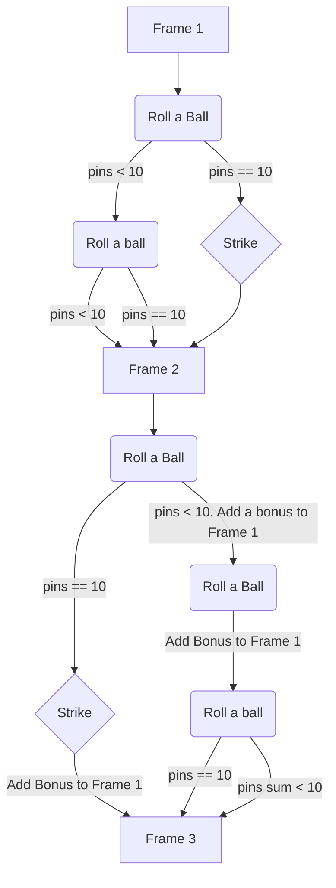

1. Describe the Problem
   define the bowling game and the scores

   | Frame | Roll 1 | Roll 2 | Bonus | Score |
   | ----- | ------ | ------ | ----- | ----- |
   | 1     | 9      | 1      | 10    | 19    |
   | 2     | 10     | 10     | 20    | 39    |
   | 3     | 5      | 4      | 9     | 48    |
   | 4     | 6      | 2      | 8     | 56    |
   | 5     | 10     | 10     | 20    | 76    |
   | 6     | 7      | 3      | 10    | 86    |
   | 7     | 9      | 2      | 11    | 97    |
   | 8     | 10     | 10     | 20    | 117   |
   | 9     | 8      | 1      | 9     | 126   |
   | 10    | 10     | 10     | 20    | 146   |

If the current frame is a strike, then the bonus is the number of pins knocked down in the next two frames.
If the current frame is a spare, then the bonus is the number of pins knocked down in the next frame.

